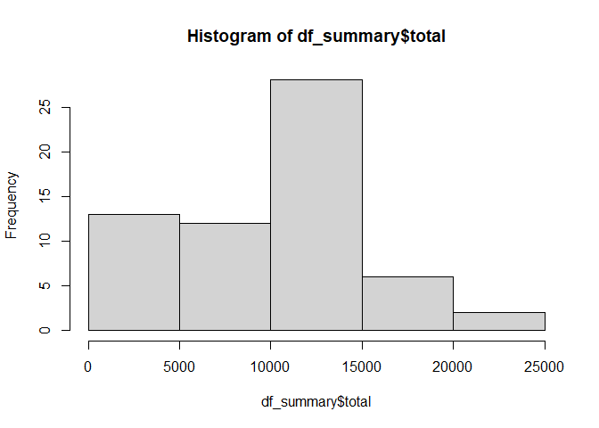
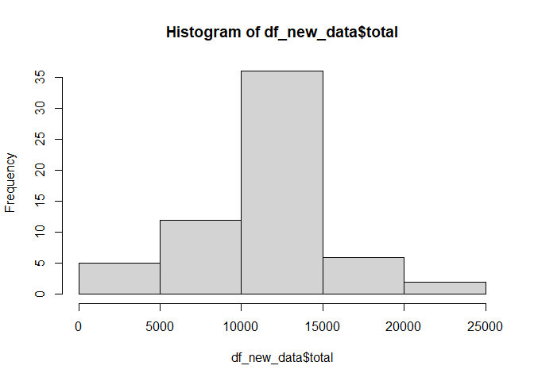

## Loading and preprocessing the data

```r
setwd("C:/Users/16469/Documents/GitHub/RepData_PeerAssessment1/")
# unzip the data if file doesn't exist
if(!file.exists("acitivity.csv"))
  unzip("activity.zip")

# read the data and adjust the classes
df <- read.csv("activity.csv", header = T,  stringsAsFactors = F,) 
df$date <- as.Date(df$date)
```
## What is mean total number of steps taken per day?

```r
library("dplyr")
```

```
## 
## Attaching package: 'dplyr'
```

```
## The following objects are masked from 'package:stats':
## 
##     filter, lag
```

```
## The following objects are masked from 'package:base':
## 
##     intersect, setdiff, setequal, union
```

```r
df_summary <- df%>%
  group_by(date)%>%
  summarize(total = sum(steps,na.rm = TRUE) )
```

```
## `summarise()` ungrouping output (override with `.groups` argument)
```

```r
hist(df_summary$total)
```

<!-- -->

```r
mean(df_summary$total)
```

```
## [1] 9354.23
```

```r
median(df_summary$total)
```

```
## [1] 10395
```
## What is the average daily activity pattern?

```r
df_daily <- df%>%
  group_by(interval)%>%
  summarize(mean = mean(steps, na.rm = TRUE))
```

```
## `summarise()` ungrouping output (override with `.groups` argument)
```

```r
plot(x = df_daily$interval, y = df_daily$mean, type = "l" , xlab = "interval", ylab = "mean" )
```

<!-- -->

```r
df_daily[which.max(df_daily$mean),]$interval
```

```
## [1] 835
```


## Imputing missing values

```r
sum(is.na(df$steps))
```

```
## [1] 2304
```

```r
#NA is replaced by the mean value
df_new <- df %>% 
  group_by(interval)%>%
  mutate(steps=ifelse(is.na(steps), mean(steps, na.rm = TRUE), steps))

#Make a histogram and calculate mean and median 
df_new_data <- df_new%>%
  group_by(date)%>%
  summarize(total = sum(steps))
```

```
## `summarise()` ungrouping output (override with `.groups` argument)
```

```r
hist(df_new_data$total)
```

<!-- -->

```r
mean(df_new_data$total)
```

```
## [1] 10766.19
```

```r
median(df_new_data$total)
```

```
## [1] 10766.19
```

## Are there differences in activity patterns between weekdays and weekends?

```r
library(ggplot2)
df_new <- df_new %>% 
  mutate(day = weekdays(date))%>%  
  mutate(day = case_when(
    day %in% c("Monday", "Tuesday", "Wednesday", "Thursday", "Friday") ~ "Weekday", 
    day %in% c("Saturday", "Sunday") ~ "Weekend"))

df_daily <- df_new%>%
  group_by(interval, day)%>%
  summarize(mean = mean(steps))
```

```
## `summarise()` regrouping output by 'interval' (override with `.groups` argument)
```

```r
ggplot(data=df_daily, aes(x = interval , y = mean))+
  geom_line()+
  facet_wrap(~day)
```

<!-- -->

